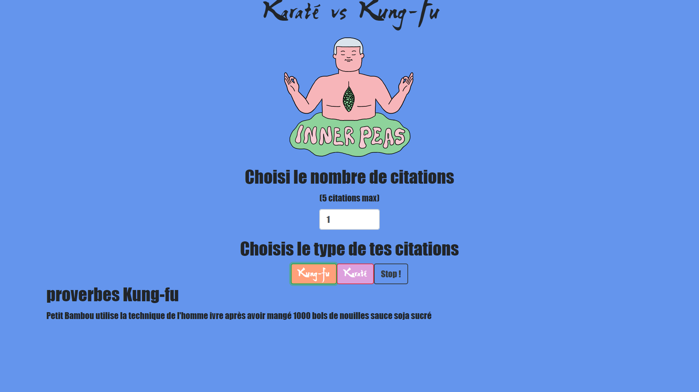

# *Générateur de citations aléatoires Karaté vs kung-fu*

## *Présentation*

* Les citations sont générées aléatoirement une par une à chaque appel du programme
JavaScript et il est possible de générer entre 1 et 5 phrases à la fois

* Chaque citation est la combinaison d'au moins 3 morceaux de phrases

* Il est Possible de choisir 2 types de citation différentre (kung-fu ou karaté)

* Une fois les citations générées, il est possible de générer de nouvelles citations ou d'arrêter là le
programme.

## *Preview*
https://syu99.github.io/Generateur-de-phrases-aleatoires_Js/

(1234567)

